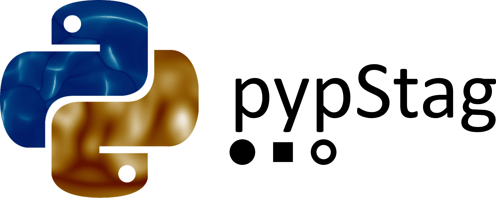

pypStag 0.5
======

pypStag is a python package for managing StagYY outputs. This package offers you an efficient solution for basic reading/processing operations and is associated with a complete visualization package for 2D and 3D representation of your StagYY data.

pypStag allows you to work on StagYY ouputs directly in a python environment with a high flexibility.

Several Jupyter Notebook are provided to show you how to use the different features of pypStag. So have a look on the directory /docs/ of the pypStag package and enjoy post-processing your data!

To install pypStag in Development mode (advised):
	0.1 first of all, install pip: https://pypi.org/project/pip/
        0.2 [*optional*] uninstall a previous version of pypStag
		pip uninstall pypStag
	1. in a terminal, entrer into the directory of pypStag
	2. execute the command:
		pip install -e ./
	   pip will managed all dependencies and refered correctly pypStag in our default python
	3. to check the installation of pypStag 
	        >> pip show pypStag

